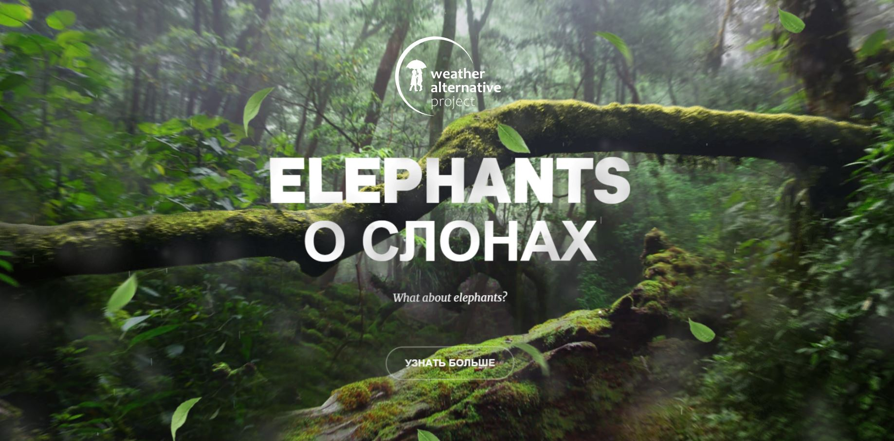

# Проект: Elephants с 3D эффектом Parallax

Pet-проект о проблеме уничтожения слонов с 3D эффектом Parallax

## [Демонстрация сайта]()

## ***Содержание:***
- [Описание проекта](#Description)
- [Используемые технологии](#Technologies)
- [Запуск проекта](#Instructions)

# Описание проекта 

**Elephants** — цель PET-проекта-привлечь внимание к проблеме уничтожения слонов. Проект реализован компонентами на React. Для запоминающегося и привлекательного Promo блока создан эффект глубины посредством 3D перспективы. Использован современный CSS. Кроме того, в проект добавлен эффект дождя с использованием Canvas. Созданы пользовтаельские hooks для отслеживания движения мыши и размера экрана.

# Используемые технологии 

1. Проект реализован с помощью framework React и утилиты Create React App (CRA).

2. Использованы функциоанльные компоненты, хуки.

3. Элементы пользовательнского интерефейса описаны с помощью JSX — это расширение синтаксиса JavaScript.

4. За описание внешнего вида сайта отвечает язык каскадных таблиц стилей CSS.

5. Все элементы страницы и стили реализованы в соответствии с концепцией БЭМ.

7. При размещении элементов на странице использовалась технология для создания сложных гибких макетов CSS Flexbox и технология CSS Grid Layout, которая предлагает систему компоновки на основе сетки со строками и столбцами.

8. Изменение внешнего вида элемнтов для корректного отображения на устройствах разного типа реализовано с помощью CSS-переменной и директив CSS - медиазапросов.

9. C помощью canvas и пользовтаельского hook отслеживания размера экрана реализован эффект дождя.

##  Запуск проекта 

`npm install` - для установки необходимых для функционирования проекта пакетов
`npm run start` — запускает сервер

